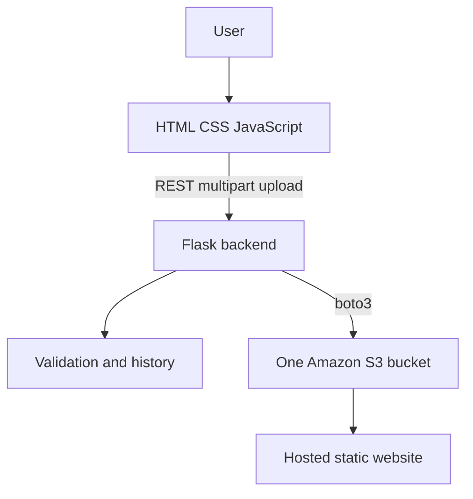

# CloudDeploy — Mini Netlify on AWS S3

CloudDeploy is a small educational static-site hosting platform. Select a complete website folder, and Flask plus boto3 validates and publishes its files under a unique prefix in one Amazon S3 bucket.

## Features

- Folder upload with `index.html` validation and path-traversal protection
- MIME-type detection and S3 object uploads
- S3 static website hosting and bucket policy configuration
- Live HTTP URL generation and copy-to-clipboard
- JSON deployment history with newest deployments first
- Environment-based configuration and normal boto3 credential discovery

## Architecture



## Setup

Install Python 3.10+ and configure AWS CLI credentials (`aws configure`). The IAM identity needs permission to list/use the bucket, upload objects, configure website hosting, and put its bucket policy. Public access block/account policy must allow the intended public website configuration.

```powershell
python -m venv venv
venv\Scripts\activate
pip install -r backend\requirements.txt
Copy-Item .env.example .env
aws sts get-caller-identity
python backend\app.py
```

Set `AWS_REGION`, `S3_BUCKET_NAME`, and optionally `MAX_UPLOAD_SIZE_MB` in `.env`. Open http://localhost:5000; the backend serves the frontend, so no separate frontend server is required.

Do not open `frontend/index.html` directly unless the Flask server is already running. If you do, the UI now targets `http://127.0.0.1:5000`, but serving the app from Flask is the recommended workflow.

## Usage

Select or drag a folder containing `index.html`, review the file list, and click **Deploy website**. After deployment, open the generated URL or review it under **Deployments**.

## Security, cost, and limitations

Credentials are never accepted by or stored in the browser and `.env` is ignored by git. Uploaded files are never executed. S3 website endpoints are HTTP-only in this version, and public website access may conflict with an account's S3 Block Public Access policy. The endpoint format is region-specific; for example, `ap-south-1` uses `bucket.s3-website.ap-south-1.amazonaws.com`. Each deployment URL includes its deployment prefix, such as `...amazonaws.com/site-a82f31/`, because all sites share one bucket. There is no authentication, custom domain, HTTPS/CloudFront, rollback, deletion, or database; history is local JSON. S3 requests and storage can incur AWS charges.

## Future enhancements

Authentication, CloudFront HTTPS, custom domains, rollback/delete operations, DynamoDB history, GitHub integration, CI/CD, custom subdomains, and deployment logs.

## Publish with git

```powershell
git init
git add .
git commit -m "Build CloudDeploy static hosting platform"
git branch -M main
git remote add origin https://github.com/YOUR-USER/YOUR-REPO.git
git push -u origin main
```
